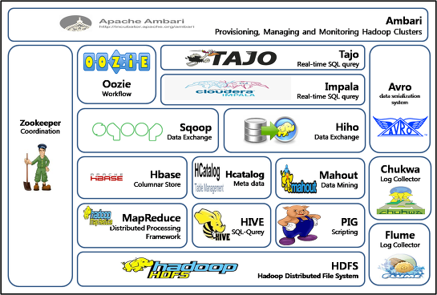

# 2021-01-04 하둡의 기초

---
## 하둡의 두 가지 특징

- 분산파일 시스템(HDFS-Hadoop Distributed File System)

- 분산처리 시스템(MapReduce)

---
## 하둡의 주요 특징

1. Scalablilty     
   장비를 증가시킬수록 성능이 linear에 가깝게 향상된다

2. Locality    
   소스에 데이터를 가져와서 소스에서 데이터를 처리하는 것이 아니라 데이터가 있는 곳에 소스를 보내서 로직을 수행한다. 

3. Fault Tolerant    
   하드 디스크 등의 손상 같은 장비나 노드의 장애를 상수로 간주한다.데이터 블록의 복사본을 중복 저장하고 유지한다.

4. 쉽게 개발할 수 있다

---
## 하둡의 역사

- 2003년 구글의 GFS 논문 발표

- 2004년 구글의 MapReduce 논문 발표

- 2008년 하둡이 하파치 탑레벨 프로젝트로 승격

---

## 하둡 에코시스템의 이해

- 하둡 에코시스템 개괄도

- 하둡 에코시스템    
  하둡의 기능을 보완하는 다양한 서브 프로젝트들의 모임    
  빅데이터의 수집, 저장, 처리, 분석, 시각화의 여러 단계를 거치는 동안 이용하는 기술들

- HDFS(Hadoop Distributed File System)    
  대용량 파일 읽기 및 쓰기 작업에 최적화된 분산 파일 시스템
  - 블록 구조의 파일 시스템    
  - 마스터 역할을 하는 네임노드 서버, 슬레이브 역할을 하는 데이터노드 서버 여러 대로 구성
  - 네임노드는 HDFS의 모든 메타데이터를 관리, 데이터노드는 주기적으로 데이터 관리
  - 데이터는 한 군데에만 저장되는 것이 아니라 여러 군데에 중복되어 저장

- YARN(Hadoop 2.0 부터 적용)    
  어플리케이션 라이프사이클 관리를 위한 아키텍처
  - Hadoop 2.0 Job Tracker의 병목현상과 애플리케이션의 호환성을 높이기 위해 Yarn 등장
  - MapReduce, Spark 등 다양한 어플리케이션은 얀에서 리소스를 할당받아서 작업을 실행한다

- MapReduce Api    
  대량의 데이터를 병렬로 분석 가능
  - 맵Map과 리듀스Reduce 함수를 합침
  - 이기종 언어에서 하둡을 사용하기 위해 MapReduce Api 사용
  - Map 데이터를 원하는 방식으로 변화
  - Reduce 원하는 데이터를 추출

- Flume
  - 분산된 서버에서 생성된 데이터를 HDFS에 안정적으로 저장하는 플랫폼
  - 연속적으로 생성되는 데이터 스트림을 HDFS에 저장하게 해주는 것
  - 로그파일, 소셜 미디어 데이터, 이메일 메시지 등등 연속적으로 생기는 데이터를 수집하는 데 사용한다.

- Sqoop
  - 큰 국자(sqoop)에서 유래
  - 대용량 데이터 전송 솔루션
  - RDBMS → HDFS, HDFS → RDBMS(전통, Oracle, MySQL, PostgreSQL, DB2)

- HBase
  - 칼럼 기반의 NoSQL 데이터베이스
  - 스키마 변경 없이 데이터 자유롭게 저장(NoSQL의 특징이기도 하다)

- Pig
  - 대용량 데이터를 다루기 위한 스크립트 언어
  - Hadoop MapReduce API를 매우 단순화해서 SQL과 유사한 형태로 설계

- Hive
  - 하둡 기반의 SQL 쿼리 엔진
  - HiveQL 제공, 피그, 스파크 등등의 도구를 이용할 수도 있다.

- Spark 
  - 인메모리 기반의 범용 분산 데이터 처리 플랫폼
  - 범용이므로, 반드시 하둡과 같이 쓰지는 않고 다른 데서도 쓰일 수 있다
  - 인메모리 실행으로 비약적인 성능 향상
  - RDD, Spark Dataframe 등의 자료구조를 활용

- Oozie
  - 하둡 작업을 관리하는 워크플로우 스케줄러
  - 여러 개의 MapReduce를 연결하여 수행하는데 각 job들의 시작과 종결, 그 사이의 각종 분기조건 등을 지정해 자동화하거나 스케줄링
  - Yarn이 개별 하둡 작업의 리소스를 관리하는 반면, 우지는 클러스터의 여러 하둡 작업을 서로 연결하고 제어한다.

- Oozie의 워크플로우 Dag Graph
  - 시작/ 종료 노드(indegree가 0인 노드, outdegree가 0인 노드)
  - 액션 노드
  - 포크 / 조인 노드 : 병렬 처리 노드
  - 판단 노드(switch keyword와 유사)

- Zookeeper
  - 분산 환경에서 서버 간의 상호 조정이 피룡한 다양한 서비스를 제공하는 코디네이션 시스템
  - 서비스가 집중되지 않게 서비스를 분산해서 동시에 처리하게 해준다
  - 처리 결과를 다른 서버와 동기화해서 데이터의 안정성을 보장해준다
  - 분산환경을 구성하는 서버들의 환경설정을 통합적으로 관리해준다

- Ambari
  - Hadoop 클러스터에서 각 시스템의 리소스를 관리하고 모니터링 하는 운영 프레임워크
  - 클러스터 상태에 대한 전체 모니터링
  - 서비스 설치, 구성, 관리를 웹 UI를 통해 간소화한다.

- External Data Storage
  - MySQL
  - mongoDB
  - cassandra
  - 쿼리 엔진

- 그 외
  - Apache DRILL : 이질적인 데이터베이스에 산재되어 있는 데이터를 읽을 수 있는 쿼리 엔진
  - presto : 페이스북
  - phoenix
  - hue
  - Apache Zeppelin

